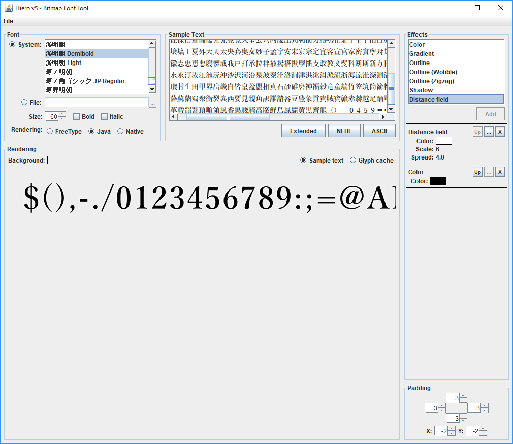

# Map用フォント

## 準備
 - Javaが起動する環境。JREをインストールすればOK。
 - この[リンク](https://drive.google.com/open?id=1mzlgumZn_YnE17VYVIQ_msHD_M6IGENN)からrunnable-hiero-ck2.jarをダウンロードしておく。
 - この[リンク](http://ch.nicovideo.jp/sevrunear/blomaga/ar539518)からNvcompressFrontEndをダウンロードしてzip解凍しておく。
 - この[リンク](https://drive.google.com/open?id=1Qb5pyH4Cx3ouBIMbEw3KhnlTspx5Qfs_)からフォントをダウンロードしてインストールしておく

## フォントfntとテクスチャpng画像の生成
runnable-hiero.jarをダブルクリックして、起動したHieroからaoyagireisyo60.hieroを読み込む。このツールは非常に重たく、起動とファイルロードに時間がかかるので注意してください。 

aoyagireisyo60.hieroには予め、必要と思われる文字のみが含まれています。それ以上の文字が必要な場合、chrs.pyを実行すると、教育漢字等の文字種が生成されます。それでテキストを上書きしてください。

メニュー＞File＞Save BMFontで、ファイルを書き出す用に指示。時間はかかるが指定した場所にfntファイルとpngファイルが出来上がるのを待つ。

## テクスチャpng画像をddsに変換する
NvcompressFrontEndを起動して、規定のフォーマットをRGBAにする。

pngファイルをD&Dして、変換ボタンを押す。一瞬でddsに変換される。

